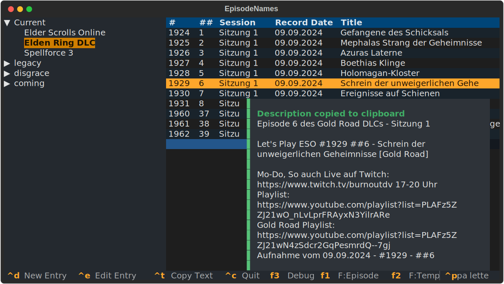
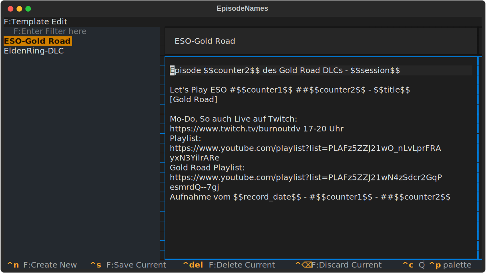

# EpisodeNames - a copy paste experience

This is a needlessly complicated tool for a simple job.

The situation was as follows: since 14 years do I make Youtube videos, mostly start-stop lets plays that honestly barely anyone watches. But, I do care and its a good way to get single player games done. Anyway, what I also care about is a proper naming scheme and numbering of all those videos and their description. Over the years I amassed over 10000 videos. My biggest project is Elder Scrolls Online which alone will reach 2000 Videos soon. The naming scheme for each episode is quite complicated and i have to iterate some numbers for every single video, some for sessions.

The solution is this over engineered piece of _equipment_:

tl;dr: this is a textual testing ground *slash* pattern mine for future projects. *Think Factorio when you first build a base to have the resource to get to the real base*

On the left a tree view with _all_ my projects, on the right the currently active view of all the episodes. A simple key combination copies the assigned template text to the clipboard (using `pyperclip` currently). There is also a screen to edit templates and projects.

If this is the only thing I wanted I could have just used some scripts that use an SQLite database directly and I would have inputed the data via an database explorer. Or some pre-fabbed input mask. **But** i like TUIs and I cannot lie.

So here we are now, mostly this is a big learning experience for me to try different TUI design patterns.

Currently I got ModalScreens, ScreenModes, Notify and one TextArea going for me. There is some other experimentation as well. I use the `peewee`ORM for this one, I never touched it before and I saw it in some random project and wanted to try it. I am not so sure if its the right way, but I hope my software stack is sound and allows, if the need arises, to replace everything under the hood.

## Todos

- [ ] Making the entire workflow in interface possible
  - [ ] Creating, Editing, Deleting Templates
  - [ ] Assigning Templates to Episodes
  - [ ] Creating Projects

- [ ] Logic functions that keep internal numbering consistent
- [ ] Styling - different colors than default
- [ ] Import/Export of data
- [ ] Use proper tools for i18n and not some thrown together gobbligob

## Ideas

- [ ] Import of all existing stuff I got on youtube, separate descriptions from rest and make this the one-stop management solution for all my videos
- [ ] Find title duplicates
- [ ] save additonal meta data
- [ ] make the interface more sleek and faster to use for the haxxor experience